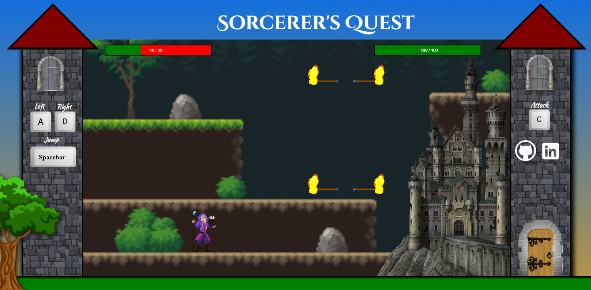
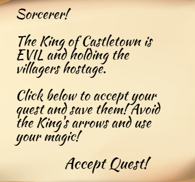

# Sorcerer's Quest
Ready to Accept Your Quest? 

https://justin-diner.github.io/sorcerers_quest/



## Description

Sorcerer's Quest is a vanilla JavaScript fantasy adventure game. You are a Sorcerer whose quest is seems simple- save the town and defeat the King hiding in Castlevania. The quest is not as simple as it sounds! The King's archers will be defending the Castle with fire arrows. Three shots and you lose! Be sure to dodge!



## Technologies 

The project is written in vanilla JavaScript, HTML, and CSS. The game utilizes the HTML Canvas API for the main animation loop. 

## User Controls
 1 - Move the character left and right by using A-D. Press spacebar to jump. (Jumping multiple times is permitted).
 2 - Use movement and jumping to dodge fire arrows. 
 3 - Cast your spell by pressing C.  
 5 - Defeat the castle.
 6 - Victory! You have saved the citizens!

## Feature Implementation 
### Sorcerer Controls 
1. The sorcerer's controls are tracked on each keydown and keyup event. When a key is down, it triggers certain class attributes boolean values. These values are checked each time the user presses a button.   

```javascript		
	window.addEventListener("keydown", (e) => {
		if (e.key === "d") {
			acceptableKeys.d.pressed = true; 
			sorcerer.moveRight();
		} else if (e.key === "a") {
			acceptableKeys.a.pressed = true; 
			sorcerer.moveLeft();
		} else if (e.key === " ") {
			acceptableKeys.space.pressed = true; 
			sorcerer.jump();
		} else if (e.key === "c" && !this.cLocked) {
			acceptableKeys.c.pressed = true;
			this.lockC();
			sorcerer.cast();
			this.castle.health -=10
			this.castle.healthbar.decrease();
		}
	})
	
	window.addEventListener("keyup", (e) => {
		if (e.key === "d") {
			acceptableKeys.d.pressed = false; 
			this.sorcerer.velocity.x = 0
			if (this.sorcerer.velocity.x === 0 && this.sorcerer.status != "jumping") {
				this.sorcerer.status = "idle";
			}
		} else if (e.key === "a") {
			acceptableKeys.a.pressed = false; 
			this.sorcerer.velocity.x = 0
			if (this.sorcerer.velocity.x === 0 && this.sorcerer.status != "jumping") {
				this.sorcerer.status = "idle";
			}
		} else if (e.key === " ") {
			acceptableKeys.space.pressed = false; 
		} else if (e.key === "c" && !this.cLocked) {
			acceptableKeys.c.pressed = false;
		}
	})
```
### Hit Detection
Hit Detection was completed by the checking whether each arrow's hitbox is within the sorcerer's hitbox pixel boundaries. This boolean check is completed on each loop of the animation loop. If an arrow is detected, the arrow is timed out from doing damage for 1 second. The stopping function is critical because it prohibits arrows from damaging the sorcerer multiple times.  
 
```javascript 
	isCollided() {
		if (this.deathCheck()) {
			return true; 
		}

		const sorcererHitBox = this.sorcerer.hitboxDims();
		const topLeft = sorcererHitBox.topLeft;
		const topRight = sorcererHitBox.topRight;
		const bottomRight = sorcererHitBox.bottomRight;

		for (let i = 0; i < this.inGameArrows.length; i++) { 
			if (!this.inGameArrows[i].recentlyHit && this.inGameArrows[i].moving) {
				const arrowPosX = this.inGameArrows[i].hitbox.position.x;
				const arrowPosY = this.inGameArrows[i].hitbox.position.y

				if (
					(arrowPosX > topLeft[0] && 
					arrowPosX < topRight[0]) &&
					(arrowPosY < bottomRight[1] && 
						arrowPosY > topRight[1])
				) {
						this.stopArrowInGameArrowDamage(i);
						this.inGameArrows[i].ifHit();
						this.sorcerer.health -= 10;
						this.sorcerer.healthBar.decrease();
						this.newlyGeneratedArrows.push(utilities.randomShootingPosition());
				}
			}
		}

		if (this.newlyGeneratedArrows.length) {
			for (let i = 0; i < this.newlyGeneratedArrows.length; i++) { 
				if (!this.newlyGeneratedArrows[i].recentlyHit && this.newlyGeneratedArrows[i].moving) {
					const arrowPosX = this.newlyGeneratedArrows[i].hitbox.position.x;
					const arrowPosY = this.newlyGeneratedArrows[i].hitbox.position.y
	
					if (
						(arrowPosX > topLeft[0] && 
						arrowPosX < topRight[0]) &&
						(arrowPosY < bottomRight[1] && 
							arrowPosY > topRight[1])
					) {
							this.stopNewlyGeneratedArrowDamage(i) ;
							this.newlyGeneratedArrows[i].ifHit();
							this.sorcerer.health -= 10;
							this.sorcerer.healthBar.decrease();
							this.newlyGeneratedArrows.push(utilities.randomShootingPosition());
					}
				}
			}
		}
	}
```

## Features in Development
* Timer for the sorcerer's cast. 
* Healing on the castle. 
