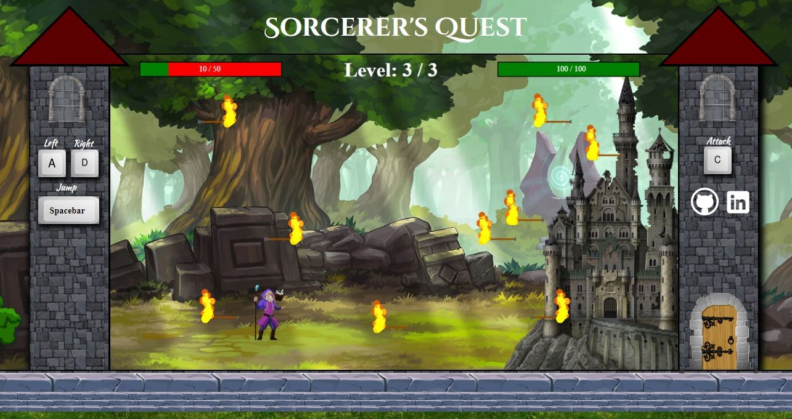
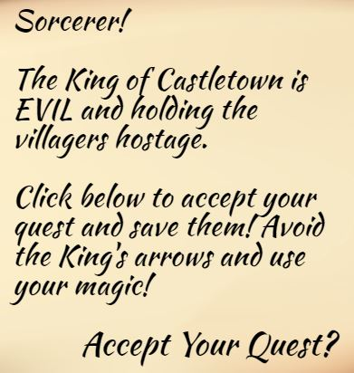

# Sorcerer's Quest



## Description

Sorcerer's Quest is a vanilla JavaScript fantasy adventure game. No external libraries were utilized when making this project. You play as a Sorcerer whose quest seems simple-save the townspeople and defeat the King of Castlevania. The King's archers will be defending the castle with fire arrows. Three shots and you lose! Be sure to dodge!

Ready to Accept Your Quest? Click the live link below. 
https://justin-diner.github.io/sorcerers_quest/  



## Technologies 

The project is written with vanilla JavaScript, HTML, and CSS. The game utilizes the HTML Canvas API for the main animation loop. 

## User Controls
 1 - Move the character left and right by using A-D. Press spacebar to jump. (Jumping multiple times is permitted).
 2 - Use movement and jumping to dodge fire arrows. 
 3 - Cast your spell by pressing C. Your spell has a 3 second recharge time.
 5 - Defeat the King and his castle.
 6 - Victory! You have saved the citizens!

## Feature Implementation 
### Sorcerer Controls 
1. The sorcerer's controls are tracked through an event listener on the window at the beginning of each game. The listener listens for keydown and keyup events. When a key is down, it triggers specific class attributes by changes in boolean values. These values are checked each time the user presses a button and are associated with different actions and objects. Velocity controls the sorcerer's movement speed and changes with each button press. For example, on ```keyup``` events it changes to 0.   

```javascript		
window.addEventListener("keydown", (e) => {
  if (e.key === "d") {
    acceptableKeys.d.pressed = true; 
    sorcerer.moveRight();
  } else if (e.key === "a") {
    acceptableKeys.a.pressed = true; 
    sorcerer.moveLeft();
  } else if (e.key === " ") {
    acceptableKeys.space.pressed = true; 
    sorcerer.jump();
  } else if (e.key === "c" && !this.cLocked) {
    acceptableKeys.c.pressed = true;
    this.lockC();
    sorcerer.cast();
    this.castle.health -=10
    this.castle.healthbar.decrease();
  }
})
	
window.addEventListener("keyup", (e) => {
  if (e.key === "d") {
    acceptableKeys.d.pressed = false; 
    this.sorcerer.velocity.x = 0
    if (this.sorcerer.velocity.x === 0 && this.sorcerer.status != "jumping") {
      this.sorcerer.status = "idle";
    }
  } else if (e.key === "a") {
    acceptableKeys.a.pressed = false; 
    this.sorcerer.velocity.x = 0
    if (this.sorcerer.velocity.x === 0 && this.sorcerer.status != "jumping") {
      this.sorcerer.status = "idle";
    }
  } else if (e.key === " ") {
    acceptableKeys.space.pressed = false; 
  } else if (e.key === "c" && !this.cLocked) {
    acceptableKeys.c.pressed = false;
  }
})
```
### Hit Detection
Hit Detection was completed by checking whether each arrow's hitbox is within the sorcerer's hitbox's pixel boundaries. This boolean check is completed on each run of the animation loop. If an arrow is detected, the arrow is immediately timed out from doing damage for 1 second. This stopping function is critical, because without it the sorcerer would be damaged by arrows on initial hit and then multiple times per second as the arrow movies through the boundaries. Additionally, on level 3, if the sorcerer is hit, a new arrow with a diagonal move path spawns. These arrows have their own array in the class object and portion of the tracking function. 
 
```javascript 
isCollided() {
  if (this.deathCheck()) {
    return true; 
  }

  const sorcererHitBox = this.sorcerer.hitboxDims();
  const topLeft = sorcererHitBox.topLeft;
  const topRight = sorcererHitBox.topRight;
  const bottomRight = sorcererHitBox.bottomRight;
  
  for (let i = 0; i < this.inGameArrows.length; i++) { 
    if (!this.inGameArrows[i].recentlyHit && this.inGameArrows[i].moving) {
      const arrowPosX = this.inGameArrows[i].hitbox.position.x;
      const arrowPosY = this.inGameArrows[i].hitbox.position.y
      
        if (
          (arrowPosX > topLeft[0] && 
          arrowPosX < topRight[0]) &&
          (arrowPosY < bottomRight[1] && 
          arrowPosY > topRight[1])
        ) {
          this.stopArrowInGameArrowDamage(i);
          this.inGameArrows[i].ifHit();
          this.sorcerer.health -= 10;
          this.sorcerer.healthBar.decrease();
          this.newlyGeneratedArrows.push(utilities.randomShootingPosition());
        }
      }
    }
    
    if (this.newlyGeneratedArrows.length) {
      for (let i = 0; i < this.newlyGeneratedArrows.length; i++) { 
        if (!this.newlyGeneratedArrows[i].recentlyHit && this.newlyGeneratedArrows[i].moving) {
          const arrowPosX = this.newlyGeneratedArrows[i].hitbox.position.x;
          const arrowPosY = this.newlyGeneratedArrows[i].hitbox.position.y
          if (
            (arrowPosX > topLeft[0] && 
            arrowPosX < topRight[0]) &&
            (arrowPosY < bottomRight[1] && 
            arrowPosY > topRight[1])
          ) {
            this.stopNewlyGeneratedArrowDamage(i) ;
            this.newlyGeneratedArrows[i].ifHit();
            this.sorcerer.health -= 10;
            this.sorcerer.healthBar.decrease();
            this.newlyGeneratedArrows.push(utilities.randomShootingPosition());
          }
        }
      }
    }
  }
```

At this point, the game has three levels with increasing difficulty. More levels may be added later. Core concepts stressed through the creation of the game were utilizing the CanvasAPI, hitbox detection, sprite animation, event listeners, DOM manipulation, helper function creation to track moving variables, and working with loops within the main animation loop.  

## Features in Development
* Additional levels. 
* Healing on the castle. 
